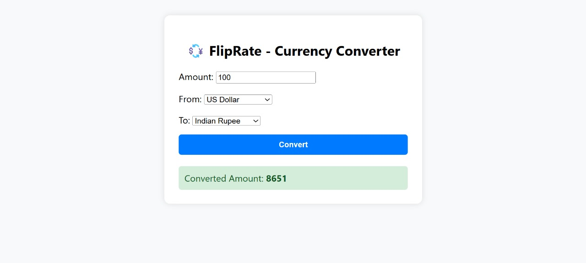

# 💱 FlipRate - Currency Converter

*FlipRate* is a Django-based web application that allows users to convert currencies in real time using live exchange rates. It provides a simple and responsive interface for converting amounts between different world currencies.

---

## 📸 Screenshot


(Optional: Add a screenshot showing the UI)

---

## 🚀 Features

- 🔄 Real-time currency conversion using an external API
- ✅ Simple and intuitive form interface
- 🔐 CSRF-protected and secure form submission
- 📱 Responsive design for mobile and desktop
- ⚠ Graceful error handling for invalid inputs and API failures

---

## 🛠 Tech Stack

- *Backend*: Django (Python)
- *Frontend*: HTML, CSS
- *API*: [exchangerate.host](https://exchangerate.host/)
- *Static Files*: Managed with Django 

---

## 📦 Installation & Setup

```bash
# Clone the repository
git clone https://github.com/abhishiktha-15/Fliprate
cd fliprate-currency-converter

# Create a virtual environment
python -m venv env
source env/bin/activate  # For Windows: env\Scripts\activate

# Install dependencies
pip install -r requirements.txt

# Run migrations
python manage.py migrate

# Start the development server
python manage.py runserver
